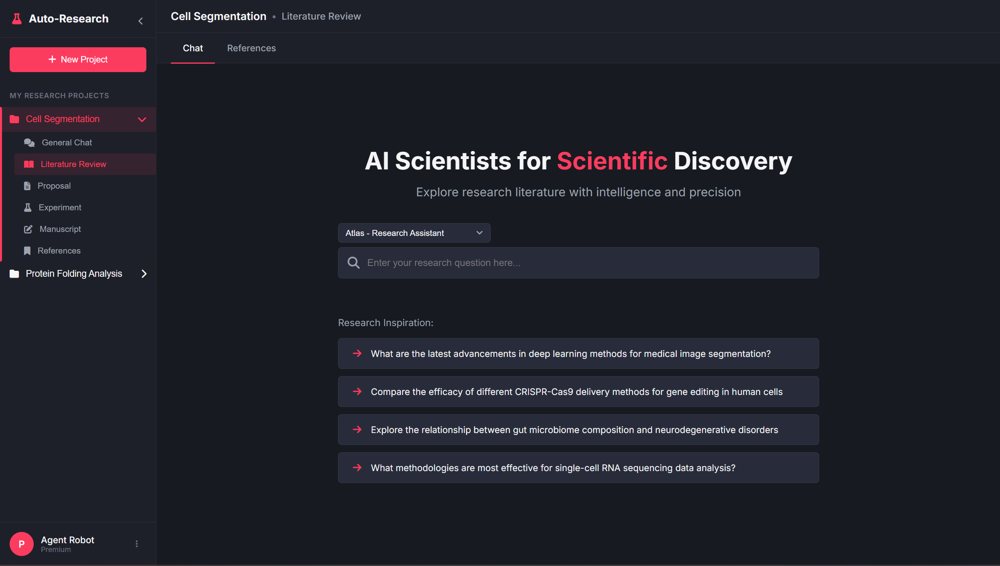
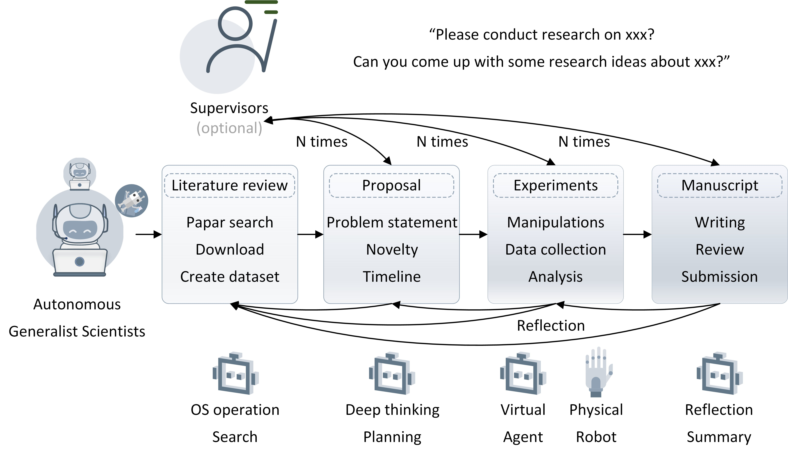
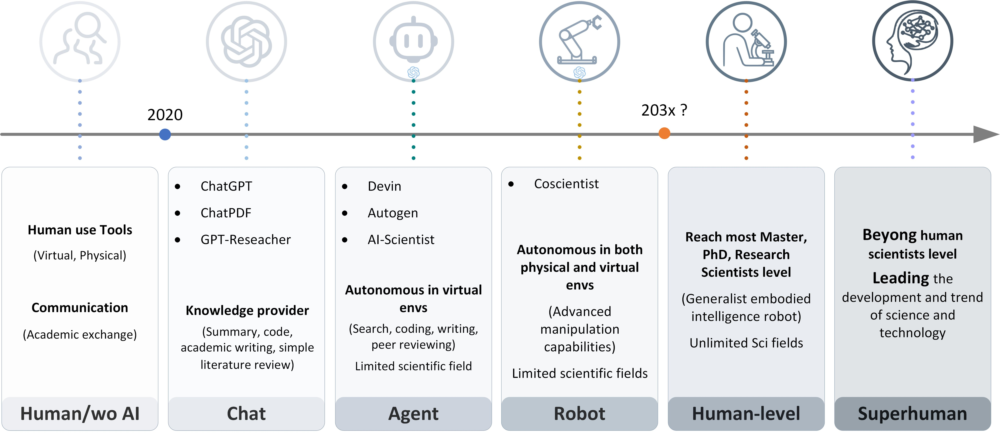

# Auto-Research
Autonomous Generalist Scientist: Towards and Beyond Human-Level Scientific Research with Agentic and Embodied AI and Robots.

The accelerating pace of scientific research highlights the need for more efficient, accurate, and comprehensive methodologies. Traditional research methods are often hindered by the limitations of manual experimentation and data collection in isolated environments, resulting in slow and resource-intensive processes. Besides, multidisciplinary research presents significant challenges due to the complexities of integrating knowledge from various fields, often surpassing the expertise of individual researchers. The limited knowledge base of single researchers constrains the scope and depth of inquiry, complicating efforts to fully explore complex interdisciplinary problems.
To address these challenges, it is crucial to develop automatic systems that can dynamically interact with both physical and virtual environments while facilitating the integration of knowledge across multiple disciplines. 
Foundation AI models, such as large language models, are trained on vast amount of data from diverse sources, enabling them to acquire knowledge across various scientific disciplines. Therefore, it is promising to build the generalist AI robot scientist for autonomous research based on these foundation models and robot technologies.

<p align="center">
  
  <br>
  <em>UI</em>
</p>


## Overview

The Autonomous Generalist Scientist （AI Scientist） project aims to revolutionize the academic research process by introducing a framework for fully automated research agents/robots. This initiative seeks to integrate artificial intelligence into every stage of research—from literature reviews to proposal, experiment, writing, submitting, reviewing manuscripts. Our vision is to facilitate a seamless research workflow that enhances productivity and fosters innovation in scientific inquiry. Here’s how we envision the integration of automated agents and robotics evolving within the framework:

<p align="center">
  
  <br>
  <em>Auto Research Agents framework and vision</em>
</p>

Phase 1: Software-Only Agents
Initially, the project will focus on software-only agents that can perform tasks not requiring physical interaction with the real world. 

Phase 2: Integration of Robotics
As the project matures and the capabilities of our agents evolve, we plan to introduce robotics to carry out physical tasks and experiments in the laboratory. 


<p align="center">
  
  <br>
  <em>Auto Research Timeline</em>
</p>

## Directory Structure

- `gscientist/`: The main directory containing the core components of Auto-Research.
  - `agents/`: Contains the agent implementations.
  - `server/`: Hosts the backend API and server-related code.
  - `tools/`: Utility scripts and built-in tools.
  - Other modules such as `project_manager.py` and `__init__.py` reside here.
- `ui/`: User interface assets.
  - `frontend/`: Web UI assets.
  - `qt/`: (Optional) Desktop UI components built with PyQt or PySide6.
- `config/`: Configuration files (e.g., `config.yml`).
- `docs/`: Documentation files and guides.
- `tests/`: Unit and integration tests.
- Root-level files:
  - `start.py`: Entry point to run both backend and frontend servers.
  - `setup.py`, `requirements.txt`, `.gitignore`, `LICENSE`, and this `README.md`.

## Getting Started

### Install Dependencies
Ensure you have Python 3.8 or later installed. Then install the required packages:
```bash
pip install -r requirements.txt
```

### Configure the Project
Copy the template configuration file and adjust it as needed:
```bash
copy config\config_template.yml config\config.yml
```
(On Windows, you may also use xcopy or copy manually via the file explorer.)

### Initialize the Project
The project manager automatically creates the database (research_projects.db) in the project root when you create a project.

### Run the Application
Start both the backend and frontend servers by running:
```bash
python start.py
```
You can then access:
- The FastAPI server at http://localhost:8000
- The frontend UI at http://localhost:8080

### Run Tests
To run the unit and integration tests, execute:
```bash
pytest
```

### Contributions
Contributions are welcome! To help improve the project, please follow these guidelines:

#### Reporting Issues
Use the GitHub issue tracker to report bugs or request enhancements.

#### Submitting Pull Requests
- Fork the repository and create a new branch for your feature or bug fix.
- Ensure your changes adhere to the project’s coding standards.
- Add or update documentation as needed.
- Submit a pull request with a clear description of your changes.

#### Discussion and Community
Join our Discord server for discussions, or check our Outline Google Doc for project ideas and planning.
For detailed guidelines, please refer to the Contribution Guide.

## Star History

[](https://star-history.com/#universea/Auto-Research&Date)

## Citation
```
@article{zhang2025scaling,
  title={Scaling Laws in Scientific Discovery with AI and Robot Scientists},
  author={Zhang, Pengsong and Zhang, Heng and Xu, Huazhe and Xu, Renjun and Wang, Zhenting and Wang, Cong and Garg, Animesh and Li, Zhibin and Ajoudani, Arash and Liu, Xinyu},
  journal={arXiv preprint arXiv:2503.22444},
  year={2025}
}

@article{zhangautonomous,
  title={Autonomous Generalist Scientist: Towards and Beyond Human-Level Scientific Research with Agentic and Embodied AI and Robots},
  author={Zhang, Pengsong and Zhang, Heng and Xu, Huazhe and Xu, Renjun and Wang, Zhenting and Wang, Cong and Garg, Animesh and Li, Zhibin and Liu, Xinyu and Ajoudani, Arash},
  journal={ResearchGate preprint RG.2.2.35148.01923},
  year={2024}  
}
```