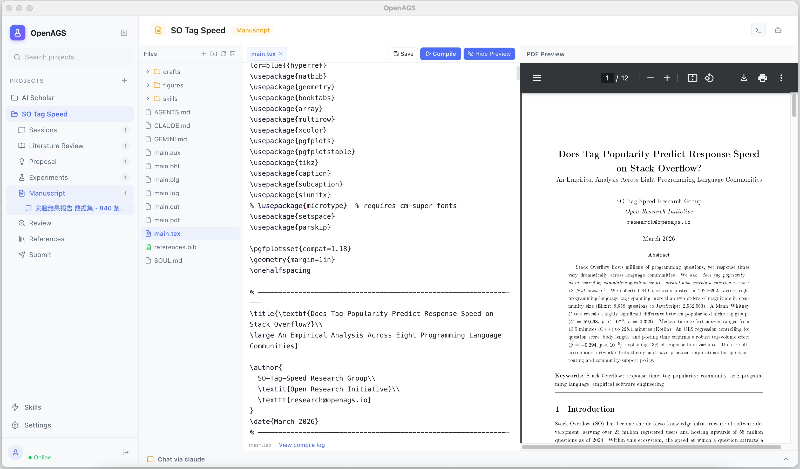

<div align="center">

# OpenAGS

**Scientifique Généraliste Autonome Ouvert**

Un framework open-source pour la recherche scientifique entièrement autonome — de la revue de littérature à la rédaction de manuscrits.

[](LICENSE)
[](https://python.org)
[](https://nodejs.org)

[Démarrage rapide](#démarrage-rapide) &bull; [Architecture](#architecture) &bull; [Documentation](../architecture.md) &bull; [Citation](#citation)

[English](../../README.md) | [中文](ZH.md) | [日本語](JA.md) | Français | [Deutsch](DE.md) | [العربية](AR.md)

</div>

---

OpenAGS orchestre une équipe d'agents IA qui collaborent tout au long du cycle de recherche — revue de littérature, génération d'hypothèses, expériences, rédaction de manuscrits et évaluation par les pairs. Un seul framework, de bout en bout, entièrement autonome.

<div align="center">
  
  <br>
  <sub>OpenAGS Desktop — Espace de travail multi-agents avec éditeur LaTeX intégré</sub>
</div>

---

## Démarrage rapide

### Installation

```bash
git clone https://github.com/openags/OpenAGS.git
cd OpenAGS
uv sync
```

Configurer votre fournisseur LLM :

```bash
uv run openags config default_backend.model deepseek/deepseek-chat
uv run openags config default_backend.api_key sk-your-key
```

### Lancement

```bash
# Application de bureau (Electron)
cd desktop && pnpm install && pnpm dev

# Mode navigateur (sans Electron)
cd desktop && pnpm build && pnpm serve    # → http://localhost:3001

# CLI uniquement
uv run openags init my-project --name "Ma Recherche"
uv run openags chat my-project
```

---

## Architecture

```
React UI (navigateur + Electron)
    ↓ WebSocket + HTTP
Serveur Node.js (Express)
  /chat  → Claude SDK, Codex SDK, Cursor CLI, Gemini CLI
  /shell → Terminal PTY (node-pty)
  /api/* → Proxy vers le backend Python
    ↓ HTTP
Backend Python (FastAPI)
  Orchestrateur → Boucle Agent → Compétences → Outils → Mémoire
    ↓
Services externes : API LLM, arXiv, Semantic Scholar, Docker, SSH
```

## Fournisseurs supportés

**LLM (via LiteLLM — 100+ supportés)** : DeepSeek, OpenAI, Anthropic, Google, OpenRouter, Ollama, etc.

**Backends CLI Agent** : Claude Code, Codex, Cursor, Gemini CLI

---

## Star History

<div align="center">

[](https://star-history.com/#openags/OpenAGS&Date)

</div>

## Citation

```bibtex
@article{zhang2025scaling,
  title   = {Scaling Laws in Scientific Discovery with AI and Robot Scientists},
  author  = {Zhang, Pengsong and Zhang, Heng and Xu, Huazhe and Xu, Renjun and
             Wang, Zhenting and Wang, Cong and Garg, Animesh and Li, Zhibin and
             Ajoudani, Arash and Liu, Xinyu},
  journal = {arXiv preprint arXiv:2503.22444},
  year    = {2025}
}
```

## Licence

[MIT](LICENSE)
